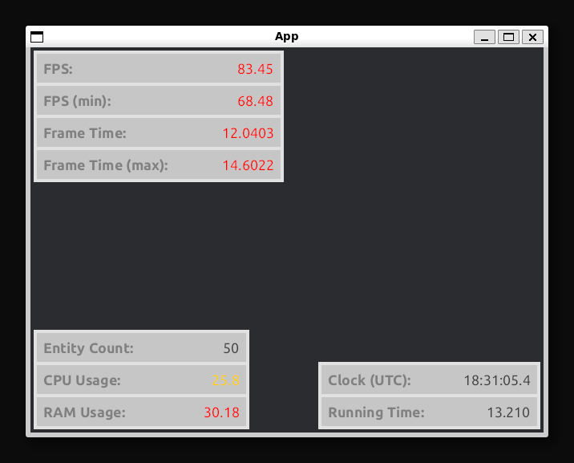

# Customizable Performance/Debug Overlay for Bevy UI

[](https://crates.io/crates/iyes_perf_ui)
[](https://docs.rs/iyes_perf_ui/)
[](./LICENSE)

Sponsor me:

<a href="https://github.com/sponsors/inodentry"><button class="ghsponsors-button">GitHub Sponsors</button></a>

Bevy Compatibility:

| Bevy Version | Plugin Version |
|--------------|----------------|
| `0.16`       | `0.5`          |
| `0.15`       | `0.4`          |
| `0.14`       | `0.3`          |
| `0.13`       | `0.2`,`0.1`    |

---

This crate provides an implementation of an in-game performance/debug UI overlay
for the [Bevy game engine](https://bevyengine.org).

The goal of this crate is to make it as useful as possible for any Bevy project:
 - Made with Bevy UI (not egui or any other 3rd-party UI solution)
 - Easy to set up (see [`simple`](examples/simple.rs) example)
 - Modular! You decide what info you want to display!
   - Choose any combination of predefined entries (see [`specific_entries`](examples/specific_entries.rs) example):
     - Framerate (FPS), Frame Time, Frame Count, ECS Entity Count, CPU Usage, RAM Usage,
       Render CPU Time, Render GPU Time,
       Wall Clock, Running Time, Fixed Time Step, Fixed Overstep,
       Cursor Position, Window Resolution, Window Scale Factor, Window Mode, Present Mode
   - Implement your own custom entries to display anything you like!
     - (see [`custom_minimal`](examples/custom_minimal.rs) and [`custom`](examples/custom.rs) examples)
 - Customizable appearance/styling (see [`settings`](examples/settings.rs), [`fps_minimalist`](examples/fps_minimalist.rs) examples)
 - Support for highlighting values using a custom font or color!
   - Allows you to quickly notice if something demands your attention.

---

First, make sure to add the plugin to your app:

```rust
app.add_plugins(PerfUiPlugin);
```

And then, spawning a Perf UI can be as simple as:

```rust
commands.spawn(PerfUiDefaultEntries::default());
```

This creates a Perf UI with a curated selection of entries, which are,
in my opinion, the most useful out of everything provided in this crate.

If you want a UI with all the available entries (note: may have significant
performance overhead):

```rust
commands.spawn(PerfUiAllEntries::default());
```

If you want to create a Perf UI with specific entries of your choice, just
spawn an entity with the components representing your desired entries,
instead of using the above bundles.

```rust
commands.spawn((
   PerfUiEntryFPS::default(),
   PerfUiEntryClock::default(),
   // ...
));
```

There are also some bundles to help you add some common groups of entries:

```rust
commands.spawn((
   // Contains everything related to FPS and frame time
   PerfUiFramerateEntries::default(),
   // Contains everything related to the window and cursor
   PerfUiWindowEntries::default(),
   // Contains everything related to system diagnostics (CPU, RAM)
   PerfUiSystemEntries::default(),
   // Contains everything related to fixed timestep
   PerfUiFixedTimeEntries::default(),
   // ...
));
```

If you want to customize the appearance, set the various fields in each of
the structs, instead of using `default()`. To customize settings that apply
to all entries, add the `PerfUiRoot` component.

NOTE: if you disable Bevy's built-in default font, you must specify the
fonts that you would like to use, by customizing `PerfUiRoot`.




## Fancy Widgets

It is possible to visualize the value in other ways, not just display it
as text.

`iyes_perf_ui` currently provides one such widget implementation: Bar. To
use it, wrap your entries in `PerfUiWidgetBar`.

For example, to display FPS as a Bar:

```rust
commands.spawn((
   PerfUiRoot::default(),
   PerfUiWidgetBar::new(PerfUiEntryFPS::default()),
   // ...
));
```

If you want to create your own custom widgets, have a look at implementing
the `PerfUiWidget` trait.

## Performance Warning!

Displaying the Perf UI might add non-negligible overhead to your app, depending
on configuration. The overhead can be reduced by spawning a simpler UI with
fewer entries.

Just keep this in mind. Your game will run slightly faster when the Perf UI
is not being displayed. This crate is designed to eliminate all perf overhead
when the UI is not rendered on-screen.

A "full" UI with all the entries offered by this crate can add a few hundred
microseconds of frame time on typical gaming hardware, most of which is CPU
time spent in Bevy's UI layout systems (in `PostUpdate`).

I am looking for ways to optimize this crate to reduce its overhead.
